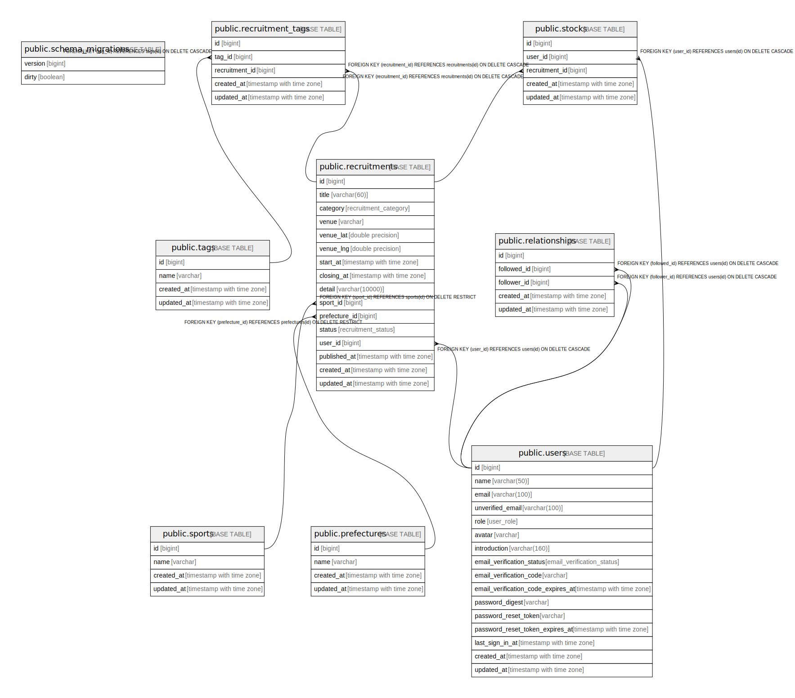

# connefut_db

## テーブル一覧

| 名前 | カラム一覧 | コメント | タイプ |
| ---- | ------- | ------- | ---- |
| [public.schema_migrations](public.schema_migrations.md) | 2 |  | BASE TABLE |
| [public.users](public.users.md) | 16 |  | BASE TABLE |
| [public.sports](public.sports.md) | 4 |  | BASE TABLE |
| [public.prefectures](public.prefectures.md) | 4 |  | BASE TABLE |
| [public.tags](public.tags.md) | 4 |  | BASE TABLE |

## ER図

---

> Generated by [tbls](https://github.com/k1LoW/tbls)
