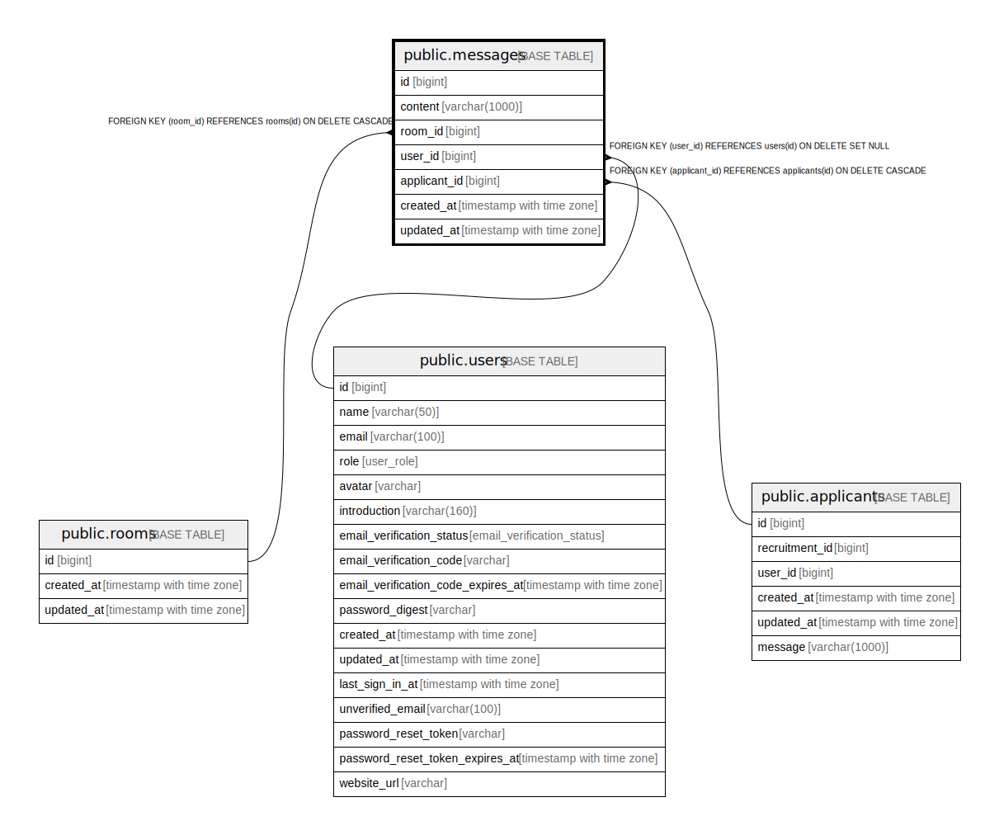

# public.messages

## Description

## Columns

| Name | Type | Default | Nullable | Children | Parents | Comment |
| ---- | ---- | ------- | -------- | -------- | ------- | ------- |
| id | bigint | nextval('messages_id_seq'::regclass) | false |  |  |  |
| content | varchar(1000) |  | true |  |  |  |
| room_id | bigint |  | false |  | [public.rooms](public.rooms.md) |  |
| user_id | bigint |  | true |  | [public.users](public.users.md) |  |
| applicant_id | bigint |  | false |  | [public.applicants](public.applicants.md) |  |
| created_at | timestamp with time zone |  | false |  |  |  |
| updated_at | timestamp with time zone |  | false |  |  |  |

## Constraints

| Name | Type | Definition |
| ---- | ---- | ---------- |
| messages_user_id_fkey | FOREIGN KEY | FOREIGN KEY (user_id) REFERENCES users(id) ON DELETE SET NULL |
| messages_applicant_id_fkey | FOREIGN KEY | FOREIGN KEY (applicant_id) REFERENCES applicants(id) ON DELETE CASCADE |
| messages_room_id_fkey | FOREIGN KEY | FOREIGN KEY (room_id) REFERENCES rooms(id) ON DELETE CASCADE |
| messages_pkey | PRIMARY KEY | PRIMARY KEY (id) |

## Indexes

| Name | Definition |
| ---- | ---------- |
| messages_pkey | CREATE UNIQUE INDEX messages_pkey ON public.messages USING btree (id) |
| messages_room_id_idx | CREATE INDEX messages_room_id_idx ON public.messages USING btree (room_id) |
| messages_user_id_idx | CREATE INDEX messages_user_id_idx ON public.messages USING btree (user_id) |

## Relations

---

> Generated by [tbls](https://github.com/k1LoW/tbls)
