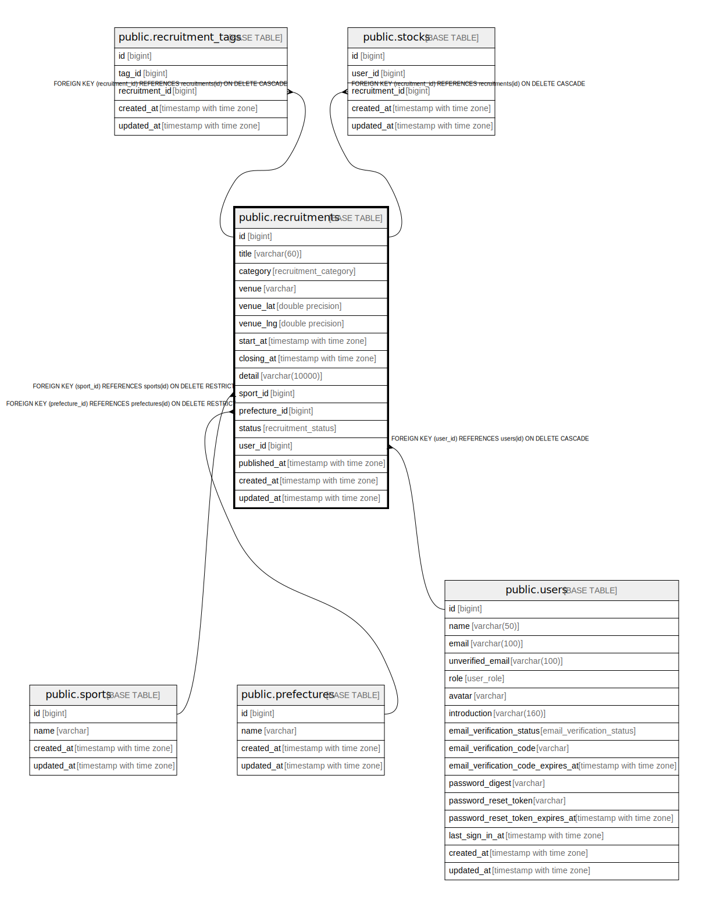

# public.recruitments

## 概要

## カラム一覧

| 名前 | タイプ | デフォルト値 | Nullable | 子テーブル | 親テーブル | コメント |
| ---- | ------ | ------------ | -------- | ---------- | ---------- | -------- |
| id | bigint | nextval('recruitments_id_seq'::regclass) | false | [public.recruitment_tags](public.recruitment_tags.md) [public.stocks](public.stocks.md) |  |  |
| title | varchar(60) |  | false |  |  |  |
| category | recruitment_category | 'opponent'::recruitment_category | false |  |  |  |
| venue | varchar |  | true |  |  |  |
| venue_lat | double precision |  | true |  |  |  |
| venue_lng | double precision |  | true |  |  |  |
| start_at | timestamp with time zone |  | true |  |  |  |
| closing_at | timestamp with time zone |  | true |  |  |  |
| detail | varchar(10000) |  | true |  |  |  |
| sport_id | bigint |  | false |  | [public.sports](public.sports.md) |  |
| prefecture_id | bigint |  | true |  | [public.prefectures](public.prefectures.md) |  |
| status | recruitment_status | 'draft'::recruitment_status | false |  |  |  |
| user_id | bigint |  | false |  | [public.users](public.users.md) |  |
| published_at | timestamp with time zone |  | true |  |  |  |
| created_at | timestamp with time zone |  | false |  |  |  |
| updated_at | timestamp with time zone |  | false |  |  |  |

## 制約一覧

| 名前 | タイプ | 定義 |
| ---- | ---- | ---------- |
| recruitments_user_id_fkey | FOREIGN KEY | FOREIGN KEY (user_id) REFERENCES users(id) ON DELETE CASCADE |
| recruitments_sport_id_fkey | FOREIGN KEY | FOREIGN KEY (sport_id) REFERENCES sports(id) ON DELETE RESTRICT |
| recruitments_prefecture_id_fkey | FOREIGN KEY | FOREIGN KEY (prefecture_id) REFERENCES prefectures(id) ON DELETE RESTRICT |
| recruitments_pkey | PRIMARY KEY | PRIMARY KEY (id) |

## INDEX一覧

| 名前 | 定義 |
| ---- | ---------- |
| recruitments_pkey | CREATE UNIQUE INDEX recruitments_pkey ON public.recruitments USING btree (id) |
| recruitments_user_id_idx | CREATE INDEX recruitments_user_id_idx ON public.recruitments USING btree (user_id) |
| recruitments_prefecture_id_idx | CREATE INDEX recruitments_prefecture_id_idx ON public.recruitments USING btree (prefecture_id) |
| recruitments_sport_id_idx | CREATE INDEX recruitments_sport_id_idx ON public.recruitments USING btree (sport_id) |

## ER図

---

> Generated by [tbls](https://github.com/k1LoW/tbls)
