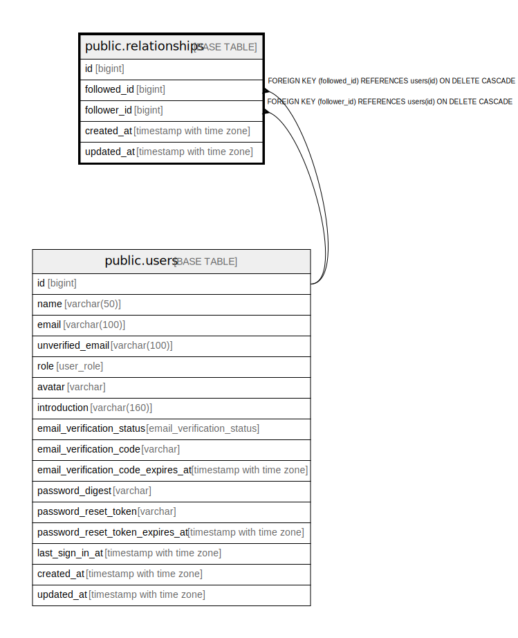

# public.relationships

## Description

## Columns

| Name | Type | Default | Nullable | Children | Parents | Comment |
| ---- | ---- | ------- | -------- | -------- | ------- | ------- |
| id | bigint | nextval('relationships_id_seq'::regclass) | false |  |  |  |
| follower_id | bigint |  | false |  | [public.users](public.users.md) |  |
| followed_id | bigint |  | false |  | [public.users](public.users.md) |  |
| created_at | timestamp with time zone |  | false |  |  |  |
| updated_at | timestamp with time zone |  | false |  |  |  |

## Constraints

| Name | Type | Definition |
| ---- | ---- | ---------- |
| relationships_followed_id_fkey | FOREIGN KEY | FOREIGN KEY (followed_id) REFERENCES users(id) ON DELETE CASCADE |
| relationships_follower_id_fkey | FOREIGN KEY | FOREIGN KEY (follower_id) REFERENCES users(id) ON DELETE CASCADE |
| relationships_pkey | PRIMARY KEY | PRIMARY KEY (id) |
| relationships_follower_id_followed_id_key | UNIQUE | UNIQUE (follower_id, followed_id) |

## Indexes

| Name | Definition |
| ---- | ---------- |
| relationships_pkey | CREATE UNIQUE INDEX relationships_pkey ON public.relationships USING btree (id) |
| relationships_follower_id_followed_id_key | CREATE UNIQUE INDEX relationships_follower_id_followed_id_key ON public.relationships USING btree (follower_id, followed_id) |
| relationships_followed_id_idx | CREATE INDEX relationships_followed_id_idx ON public.relationships USING btree (followed_id) |
| relationships_follower_id_idx | CREATE INDEX relationships_follower_id_idx ON public.relationships USING btree (follower_id) |

## Relations

---

> Generated by [tbls](https://github.com/k1LoW/tbls)
