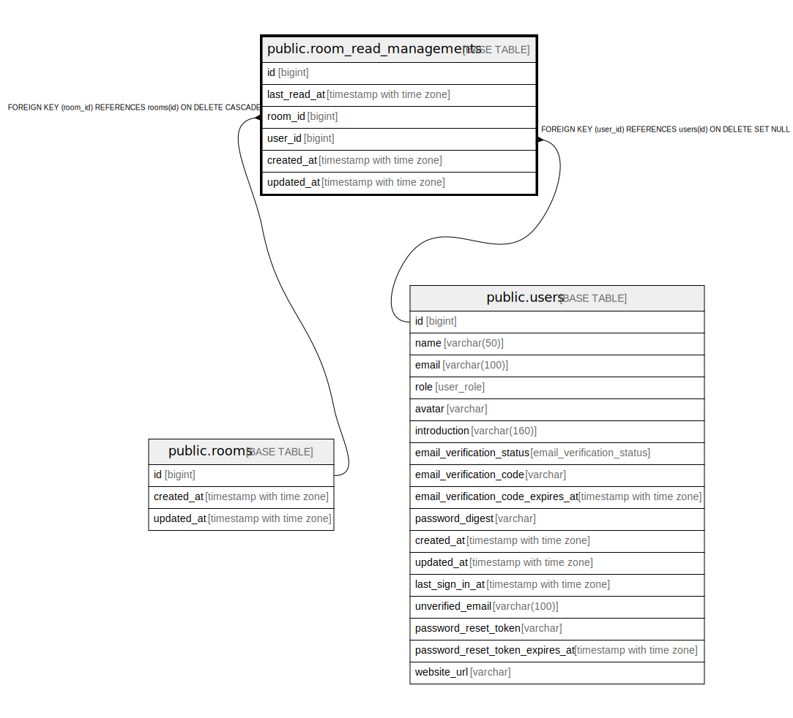

# public.room_read_managements

## Description

## Columns

| Name | Type | Default | Nullable | Children | Parents | Comment |
| ---- | ---- | ------- | -------- | -------- | ------- | ------- |
| id | bigint | nextval('room_read_managements_id_seq'::regclass) | false |  |  |  |
| last_read_at | timestamp with time zone |  | true |  |  |  |
| room_id | bigint |  | false |  | [public.rooms](public.rooms.md) |  |
| user_id | bigint |  | true |  | [public.users](public.users.md) |  |
| created_at | timestamp with time zone |  | false |  |  |  |
| updated_at | timestamp with time zone |  | false |  |  |  |

## Constraints

| Name | Type | Definition |
| ---- | ---- | ---------- |
| room_read_managements_user_id_fkey | FOREIGN KEY | FOREIGN KEY (user_id) REFERENCES users(id) ON DELETE SET NULL |
| room_read_managements_room_id_fkey | FOREIGN KEY | FOREIGN KEY (room_id) REFERENCES rooms(id) ON DELETE CASCADE |
| room_read_managements_pkey | PRIMARY KEY | PRIMARY KEY (id) |
| room_read_managements_room_id_user_id_key | UNIQUE | UNIQUE (room_id, user_id) |

## Indexes

| Name | Definition |
| ---- | ---------- |
| room_read_managements_pkey | CREATE UNIQUE INDEX room_read_managements_pkey ON public.room_read_managements USING btree (id) |
| room_read_managements_room_id_user_id_key | CREATE UNIQUE INDEX room_read_managements_room_id_user_id_key ON public.room_read_managements USING btree (room_id, user_id) |
| room_read_managements_room_id_idx | CREATE INDEX room_read_managements_room_id_idx ON public.room_read_managements USING btree (room_id) |
| room_read_managements_user_id_idx | CREATE INDEX room_read_managements_user_id_idx ON public.room_read_managements USING btree (user_id) |

## Relations

---

> Generated by [tbls](https://github.com/k1LoW/tbls)
