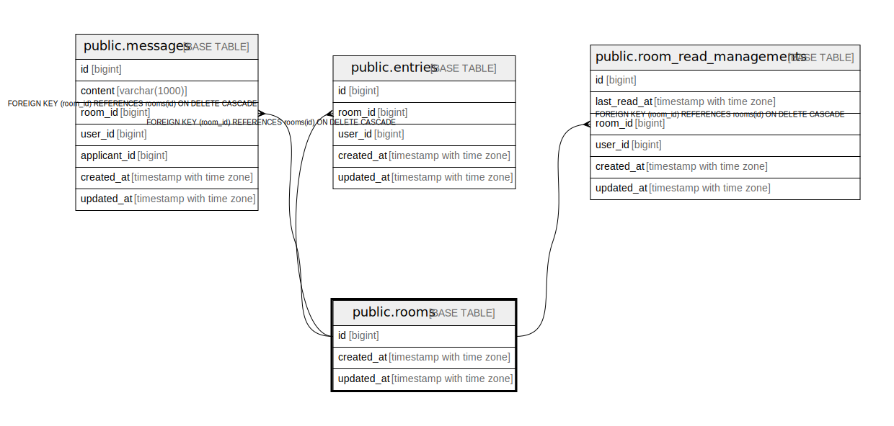

# public.rooms

## Description

## Columns

| Name | Type | Default | Nullable | Children | Parents | Comment |
| ---- | ---- | ------- | -------- | -------- | ------- | ------- |
| id | bigint | nextval('rooms_id_seq'::regclass) | false | [public.messages](public.messages.md) [public.entries](public.entries.md) [public.room_read_managements](public.room_read_managements.md) |  |  |
| created_at | timestamp with time zone |  | false |  |  |  |
| updated_at | timestamp with time zone |  | false |  |  |  |

## Constraints

| Name | Type | Definition |
| ---- | ---- | ---------- |
| rooms_pkey | PRIMARY KEY | PRIMARY KEY (id) |

## Indexes

| Name | Definition |
| ---- | ---------- |
| rooms_pkey | CREATE UNIQUE INDEX rooms_pkey ON public.rooms USING btree (id) |

## Relations

---

> Generated by [tbls](https://github.com/k1LoW/tbls)
