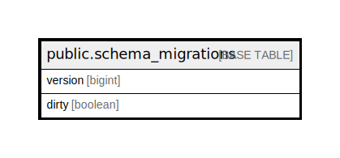

# public.schema_migrations

## 概要

## カラム一覧

| 名前 | タイプ | デフォルト値 | Nullable | 子テーブル | 親テーブル | コメント |
| ---- | ------ | ------------ | -------- | ---------- | ---------- | -------- |
| version | bigint |  | false |  |  |  |
| dirty | boolean |  | false |  |  |  |

## 制約一覧

| 名前 | タイプ | 定義 |
| ---- | ---- | ---------- |
| schema_migrations_pkey | PRIMARY KEY | PRIMARY KEY (version) |

## INDEX一覧

| 名前 | 定義 |
| ---- | ---------- |
| schema_migrations_pkey | CREATE UNIQUE INDEX schema_migrations_pkey ON public.schema_migrations USING btree (version) |

## ER図

---

> Generated by [tbls](https://github.com/k1LoW/tbls)
