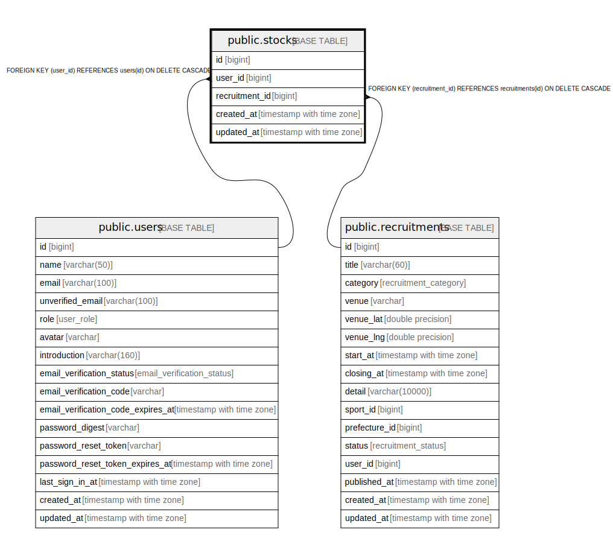

# public.stocks

## Description

## Columns

| Name | Type | Default | Nullable | Children | Parents | Comment |
| ---- | ---- | ------- | -------- | -------- | ------- | ------- |
| id | bigint | nextval('stocks_id_seq'::regclass) | false |  |  |  |
| recruitment_id | bigint |  | false |  | [public.recruitments](public.recruitments.md) |  |
| user_id | bigint |  | false |  | [public.users](public.users.md) |  |
| created_at | timestamp with time zone |  | false |  |  |  |
| updated_at | timestamp with time zone |  | false |  |  |  |

## Constraints

| Name | Type | Definition |
| ---- | ---- | ---------- |
| stocks_user_id_fkey | FOREIGN KEY | FOREIGN KEY (user_id) REFERENCES users(id) ON DELETE CASCADE |
| stocks_recruitment_id_fkey | FOREIGN KEY | FOREIGN KEY (recruitment_id) REFERENCES recruitments(id) ON DELETE CASCADE |
| stocks_pkey | PRIMARY KEY | PRIMARY KEY (id) |
| stocks_user_id_recruitment_id_key | UNIQUE | UNIQUE (user_id, recruitment_id) |

## Indexes

| Name | Definition |
| ---- | ---------- |
| stocks_pkey | CREATE UNIQUE INDEX stocks_pkey ON public.stocks USING btree (id) |
| stocks_user_id_recruitment_id_key | CREATE UNIQUE INDEX stocks_user_id_recruitment_id_key ON public.stocks USING btree (user_id, recruitment_id) |
| stocks_user_id_idx | CREATE INDEX stocks_user_id_idx ON public.stocks USING btree (user_id) |
| stocks_recruitment_id_idx | CREATE INDEX stocks_recruitment_id_idx ON public.stocks USING btree (recruitment_id) |

## Relations

---

> Generated by [tbls](https://github.com/k1LoW/tbls)
