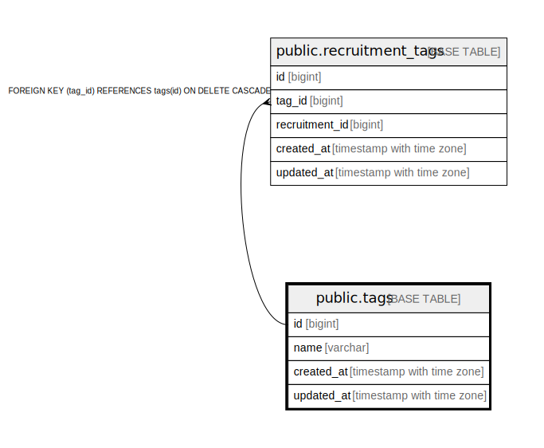

# public.tags

## 概要

## カラム一覧

| 名前 | タイプ | デフォルト値 | Nullable | 子テーブル | 親テーブル | コメント |
| ---- | ------ | ------------ | -------- | ---------- | ---------- | -------- |
| id | bigint | nextval('tags_id_seq'::regclass) | false | [public.recruitment_tags](public.recruitment_tags.md) |  |  |
| name | varchar |  | false |  |  |  |
| created_at | timestamp with time zone |  | false |  |  |  |
| updated_at | timestamp with time zone |  | false |  |  |  |

## 制約一覧

| 名前 | タイプ | 定義 |
| ---- | ---- | ---------- |
| tags_pkey | PRIMARY KEY | PRIMARY KEY (id) |
| tags_name_key | UNIQUE | UNIQUE (name) |

## INDEX一覧

| 名前 | 定義 |
| ---- | ---------- |
| tags_pkey | CREATE UNIQUE INDEX tags_pkey ON public.tags USING btree (id) |
| tags_name_key | CREATE UNIQUE INDEX tags_name_key ON public.tags USING btree (name) |

## ER図

---

> Generated by [tbls](https://github.com/k1LoW/tbls)
