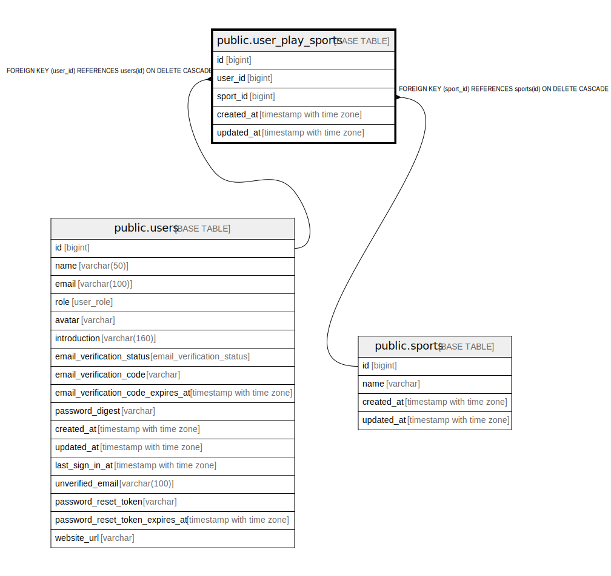

# public.user_play_sports

## Description

## Columns

| Name | Type | Default | Nullable | Children | Parents | Comment |
| ---- | ---- | ------- | -------- | -------- | ------- | ------- |
| id | bigint | nextval('user_play_sports_id_seq'::regclass) | false |  |  |  |
| user_id | bigint |  | false |  | [public.users](public.users.md) |  |
| sport_id | bigint |  | false |  | [public.sports](public.sports.md) |  |
| created_at | timestamp with time zone |  | false |  |  |  |
| updated_at | timestamp with time zone |  | false |  |  |  |

## Constraints

| Name | Type | Definition |
| ---- | ---- | ---------- |
| user_play_sports_user_id_fkey | FOREIGN KEY | FOREIGN KEY (user_id) REFERENCES users(id) ON DELETE CASCADE |
| user_play_sports_sport_id_fkey | FOREIGN KEY | FOREIGN KEY (sport_id) REFERENCES sports(id) ON DELETE CASCADE |
| user_play_sports_pkey | PRIMARY KEY | PRIMARY KEY (id) |
| user_play_sports_user_id_sport_id_key | UNIQUE | UNIQUE (user_id, sport_id) |

## Indexes

| Name | Definition |
| ---- | ---------- |
| user_play_sports_pkey | CREATE UNIQUE INDEX user_play_sports_pkey ON public.user_play_sports USING btree (id) |
| user_play_sports_user_id_sport_id_key | CREATE UNIQUE INDEX user_play_sports_user_id_sport_id_key ON public.user_play_sports USING btree (user_id, sport_id) |
| user_play_sports_user_id_idx | CREATE INDEX user_play_sports_user_id_idx ON public.user_play_sports USING btree (user_id) |
| user_play_sports_sport_id_idx | CREATE INDEX user_play_sports_sport_id_idx ON public.user_play_sports USING btree (sport_id) |

## Relations

---

> Generated by [tbls](https://github.com/k1LoW/tbls)
