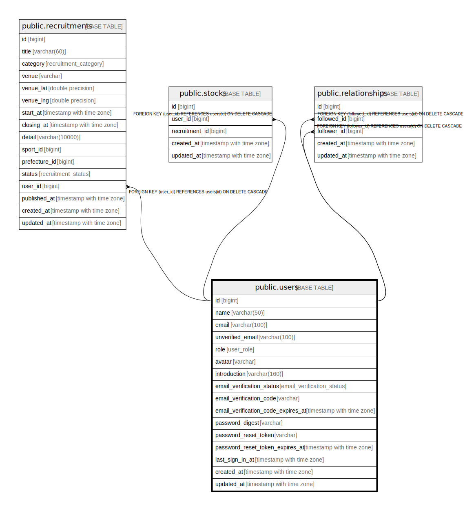

# public.users

## Description

## Columns

| Name | Type | Default | Nullable | Children | Parents | Comment |
| ---- | ---- | ------- | -------- | -------- | ------- | ------- |
| id | bigint | nextval('users_id_seq'::regclass) | false | [public.recruitments](public.recruitments.md) [public.stocks](public.stocks.md) [public.applicants](public.applicants.md) [public.messages](public.messages.md) [public.entries](public.entries.md) [public.room_read_managements](public.room_read_managements.md) [public.relationships](public.relationships.md) [public.authentications](public.authentications.md) [public.user_activity_areas](public.user_activity_areas.md) [public.user_play_sports](public.user_play_sports.md) |  |  |
| name | varchar(50) |  | false |  |  |  |
| email | varchar(100) |  | false |  |  |  |
| role | user_role | 'general'::user_role | false |  |  |  |
| avatar | varchar | 'https://abs.twimg.com/sticky/default_profile_images/default_profile.png'::character varying | false |  |  |  |
| introduction | varchar(160) |  | true |  |  |  |
| email_verification_status | email_verification_status | 'pending'::email_verification_status | false |  |  |  |
| email_verification_code | varchar |  | true |  |  |  |
| email_verification_code_expires_at | timestamp with time zone |  | true |  |  |  |
| password_digest | varchar |  | true |  |  |  |
| created_at | timestamp with time zone |  | false |  |  |  |
| updated_at | timestamp with time zone |  | false |  |  |  |
| last_sign_in_at | timestamp with time zone |  | true |  |  |  |
| unverified_email | varchar(100) |  | true |  |  |  |
| password_reset_token | varchar |  | true |  |  |  |
| password_reset_token_expires_at | timestamp with time zone |  | true |  |  |  |
| website_url | varchar |  | true |  |  |  |

## Constraints

| Name | Type | Definition |
| ---- | ---- | ---------- |
| users_pkey | PRIMARY KEY | PRIMARY KEY (id) |
| users_email_key | UNIQUE | UNIQUE (email) |
| users_password_reset_token_key | UNIQUE | UNIQUE (password_reset_token) |

## Indexes

| Name | Definition |
| ---- | ---------- |
| users_pkey | CREATE UNIQUE INDEX users_pkey ON public.users USING btree (id) |
| users_email_key | CREATE UNIQUE INDEX users_email_key ON public.users USING btree (email) |
| users_email_verification_token_idx | CREATE INDEX users_email_verification_token_idx ON public.users USING btree (email_verification_code) |
| users_password_reset_token_key | CREATE UNIQUE INDEX users_password_reset_token_key ON public.users USING btree (password_reset_token) |

## Relations

---

> Generated by [tbls](https://github.com/k1LoW/tbls)
